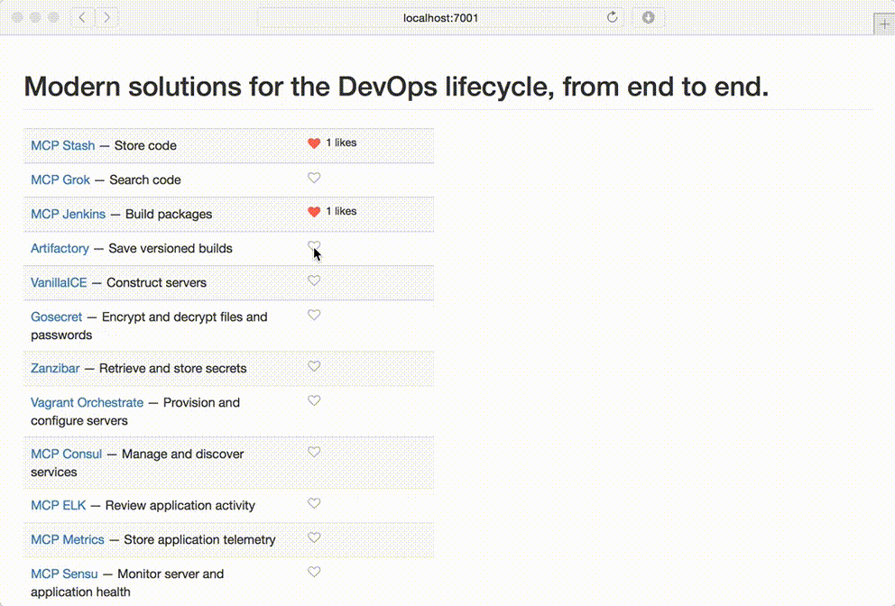

# Instalike [](https://travis-ci.org/theopak/instalike) [](http://badge.fury.io/js/instalike)

The like button for anything. Heavily inspired by http://ghbtns.com (Github Star counts). Use these attractive, globally-aware, anonymous like buttons to measure interest and hold informal polls.




# Usage

Simply drop the `<iframe>` in your HTML, and specify a `THING` to keep track of. Thing names are case-sensitive and can contain any Unicode characters.

```html
<iframe src="//instalike.click/button/?thing=THING" frameborder="0" scrolling="0" width="140px" height="16px">
</iframe>
```

Please note that in this v0 release, **you must host the API yourself**.


# Development

The tech stack is very simple:

- Backend (api)
  - Node.js
  - Express.js
  - Swagger-Tools
  - Mocha for testing
  - Hosted on-prem
- Frontend (buttons)
  - Source is JS (zero external dependencies)
  - Source is HTML + CSS3
  - Uses FontAwesome icons
  - Built by Gulp
  - Hosted on gh-pages

The `./public` directory contains all the source files:

- **btn.html** — iframe target heavily inspired by https://github.com/mdo/github-buttons.
- **script.js** — use API to get/increment like count, use localStorage for button state.
- **style.css** — supports modern browsers.
- **icons** — fontawesome minimal subset via http://icomoon.io.

```bash
npm install
npm install -g gulp
gulp default        # Build source into ./dist
node .              # Serve ./dist on http://localhost:7001
```

Here's an example of a call to the JSON API:

```
POST /{thingName} HTTP/1.1
Host: localhost
Accept: application/json

200 OK
{
  "id": 12345,
  "thing": "{thingName}",
  "count": 9000
}
```
