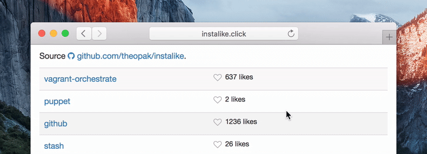

[](https://travis-ci.org/theopak/instalike) [](http://badge.fury.io/js/instalike)

# Instalike

Add like buttons to your Node.js project! They're attractive, globally aware, and completely anonymous. Use them to hold informal polls and to impress your friends.




# Usage

Place the `<iframe>` into your HTML, and specify a `THING` to keep track of. Thing names are case-sensitive and can contain any Unicode characters.

```html
<iframe src="//instalike.click/button/?thing=THING" frameborder="0" scrolling="0" width="140px" height="16px">
</iframe>
```

Please note that in this v0 release, **you must host the API yourself** using the provided vagrantfile.


# Development

The tech stack is very simple:

- Backend (api)
  - Node.js
  - Express.js
  - Swagger-Tools
  - Mocha for testing
  - Hosted on-prem
- Frontend (buttons)
  - Source is JS (zero external dependencies)
  - Source is HTML + CSS3
  - Uses FontAwesome icons
  - Built by Gulp
  - Hosted on gh-pages

The `./public` directory contains all the source files:

- **btn.html** — iframe target heavily inspired by https://github.com/mdo/github-buttons.
- **script.js** — use API to get/increment like count, use localStorage for button state.
- **style.css** — supports modern browsers.
- **icons** — fontawesome minimal subset via http://icomoon.io.

```bash
npm install -g gulp
npm install
gulp default        # Build source into ./dist
vagrant up          # Start Redis and Node. View demo at http://localhost:8080/demo/
```

Here's an example of calls to the JSON API:

```
GET /{thingName} HTTP/1.1
Host: localhost
Accept: application/json

200 OK
{
  "thing": "{thingName}",
  "count": 42
}
```

```
POST /{thingName} HTTP/1.1
Host: localhost
Accept: application/json

200 OK
{
  "thing": "{thingName}",
  "count": 43
}
```

```
PATCH /{thingName} HTTP/1.1
Host: localhost
Accept: application/json

200 OK
{
  "thing": "{thingName}",
  "count": 42
}
```
